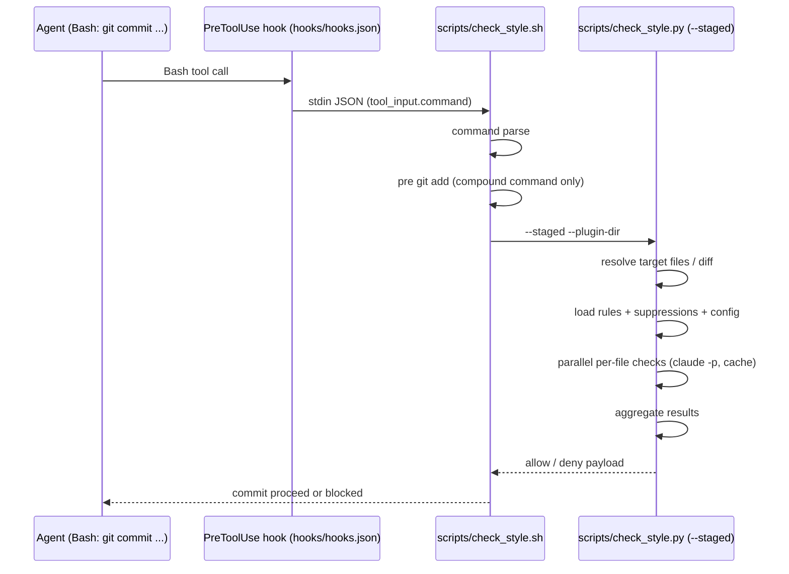
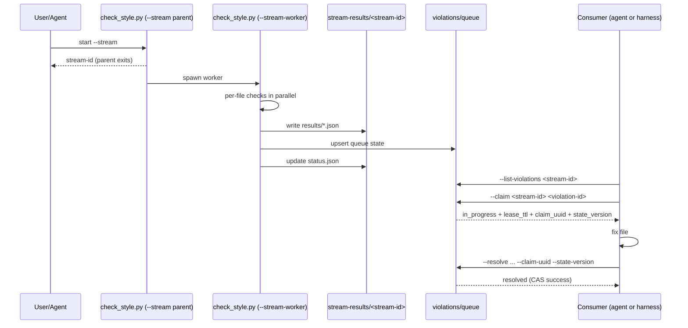
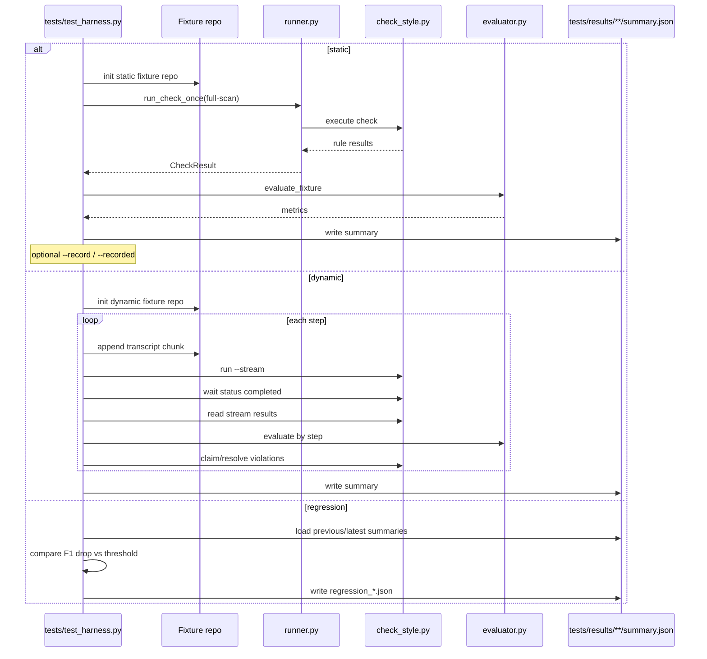

# CompleteValidator

`rules/` 内の Markdown ルールに基づく AI バリデーションを実行する Claude Code Plugin です。
git commit 時の自動チェック (PreToolUse hook)、任意のタイミングでのオンデマンド チェック、バックグラウンド ストリーム チェックの 3 つのモードをサポートします。
検出した違反は systemMessage として Claude Code エージェントに返します。

## 開発方針

- **問題を発見してもすぐに対症療法を適用しないでください。** まず根本原因を分析し、設計上の判断として CLAUDE.md や Issue に記録したうえで、適切な修正方針を検討してください。表面的な修正 (マジック ナンバーの追加、条件分岐の追加など) を即座に行うのではなく、問題の全体像を把握してから対処してください。

## インストール

### ローカル パスからインストール

```bash
# マーケットプレースとして登録
/plugin marketplace add ../complete-validator

# プラグインをインストール
/plugin install complete-validator@complete-validator --scope project
```

### GitHub からインストール

```bash
/plugin marketplace add inoueakimitsu/complete-validator
/plugin install complete-validator@complete-validator --scope project
```

### その他の Git ホスト (GitLab、Bitbucket、自前サーバー) からインストール

```bash
/plugin marketplace add https://gitlab.com/<org>/complete-validator.git
/plugin install complete-validator@complete-validator --scope project
```

`--scope` は `project` (チーム共有)、`user` (全プロジェクト)、`local` (個人、gitignore 対象) から選択できます。

## アーキテクチャ

```
Claude Code エージェント
  │
  │  Bash ツール呼び出し (git commit ...)
  │
  ▼
hooks/hooks.json (PreToolUse: Bash)
  │
  │  stdin: {"tool_input": {"command": "git commit ..."}}
  │
  ▼
scripts/check_style.sh
  │  - tool_input.command に "git commit" が含まれるか判定 (複合コマンド対応)
  │  - git commit 以外 → exit 0 (出力なし = 許可、数十 ms)
  │  - git commit → 先行する git add を実行後、check_style.py --staged --plugin-dir に委譲
  │
  ▼
scripts/check_style.py --staged --plugin-dir "$PLUGIN_DIR"
  │  1. git diff --cached で staged diff 取得
  │  2. git diff --cached --name-only --diff-filter=d で全 staged ファイル取得
  │  3. CWD から上方向に .complete-validator/rules/ を探索し、プラグイン組み込み rules/ とマージ
  │  4. .complete-validator/suppressions.md を読み込み (存在すれば)
  │  5. .complete-validator/config.json から max_workers を読み込み (デフォルト 4)
  │  6. git show :<path> で staged 版ファイル内容取得
  │  7. per-file 単位 (1 ルール × 1 ファイル) で並列チェック (max_workers で同時起動数を制限):
  │     a. cache key = sha256(prompt_version + rule_name + file_path + rule_body + diff + suppressions)
  │     b. キャッシュ ヒット → 即返却
  │     c. プロンプト構築 (1 ルール ファイル + 1 ファイルの diff/全文 + suppressions)
  │     d. claude -p でチェック実行 (CLAUDECODE 環境変数を除去してネスト検出回避)
  │     e. キャッシュ保存
  │  8. ルール名ごとに結果を集約 → deny が 1 つでもあれば全体 deny
  │
  ▼
Claude Code エージェント
  - 違反あり → deny でブロック、エージェントが修正して再 commit
  - 偽陽性 → .complete-validator/suppressions.md に記述して再 commit
  - 違反なし → allow で commit 成功
```

### ストリーム モード アーキテクチャ

```
Claude Code エージェント
  │
  │  python3 check_style.py --stream [--staged] --plugin-dir ...
  │
  ▼
check_style.py --stream
  │  1. stream-id 生成 (YYYYMMDD-HHMMSS-<random6>)
  │  2. .complete-validator/stream-results/<stream-id>/ 作成
  │  3. 古い結果ディレクトリを最新 5 件のみ保持するようクリーンアップ
  │  4. subprocess.Popen で子プロセス (--stream-worker) を起動 (start_new_session=True)
  │  5. stream-id を stdout に出力して即 exit 0
  │
  ▼
check_style.py --stream-worker --stream-id <id>
  │  1. ルールとファイルを読み込み
  │  2. (rule_file, individual_file) ペアを列挙
  │  3. ThreadPoolExecutor で並列実行 (max_workers は config.json で設定、デフォルト 4)
  │  4. 完了するたびに per-file 結果ファイルと status.json を更新
  │
  ▼
.complete-validator/stream-results/<stream-id>/
  ├── status.json        # 進捗 (total_units, completed_units, status, summary)
  ├── worker.log         # ワーカー ログ
  └── results/
      ├── <rule>__<hash>.json  # per-file 結果
      └── ...
  │
  ▼
Claude Code エージェント
  - status.json をポーリングして進捗確認
  - deny の結果を確認して修正
  - 修正後に再チェック (キャッシュ ヒットで高速)
  - 全 allow なら commit (hook は per-file preflight で高速パス)
```

全モード共通で処理単位は **1 ルール ファイル × 1 個別ファイル** です。hook モードとストリーム モードは同じ per-file 単位で `claude -p` を実行し、同じキャッシュ空間を共有します。ストリーム モードの結果は hook モードでもそのまま使われます。

## Plugin ファイル構成

```
complete-validator/
├── .claude-plugin/
│   ├── marketplace.json         # マーケットプレース定義 (配布用)
│   └── plugin.json              # Plugin メタデータ
├── git-hooks/
│   └── pre-push                 # pre-push hook (clone 後に .git/hooks/ へコピー)
├── hooks/
│   └── hooks.json               # PreToolUse hook 設定 (インストール時に自動登録)
├── skills/
│   └── complete-validator/
│       └── SKILL.md             # スキル定義 (ルール概要、使い方)
├── rules/
│   ├── python_style.md                # Python スタイル ルール
│   ├── readable_code/                 # リーダブルコード ルール (セクション分割)
│   │   ├── 01_basics.md
│   │   ├── ...
│   │   └── 11_review.md
│   └── japanese_comment_style/        # 日本語コメント スタイル ルール (ルール分割)
│       ├── 01_taigendome.md
│       ├── ...
│       └── 13_trailing_paren.md
├── scripts/
│   ├── check_style.sh           # hook エントリ ポイント (シェルラッパー)
│   └── check_style.py           # チェック本体
├── .gitignore
└── CLAUDE.md
```

## 各ファイルの役割

### `.claude-plugin/marketplace.json`

マーケットプレース定義です。`/plugin marketplace add` でこのリポジトリを登録する際に参照されます。 `source` フィールドでプラグイン本体の位置を `"./"` (リポジトリ ルート) として指定しています。

### `.claude-plugin/plugin.json`

Plugin のメタデータを定義します。 `name` がプラグイン名として使用され、スキルは `/complete-validator:complete-validator` で呼び出せます。

### `hooks/hooks.json`

- `PreToolUse` の `Bash` matcher で全 Bash ツール呼び出し時に発火します。
- `${CLAUDE_PLUGIN_ROOT}/scripts/check_style.sh` を実行します。
- Plugin インストール時に自動登録されます。
- タイムアウトは 600 秒です。

### `scripts/check_style.sh`

- stdin から hook JSON を受け取り、`tool_input.command` を python3 で抽出します。
- コマンドを `&&`、`||`、`;` で分割し、いずれかのパートが `git commit` にマッチするか判定します。
  - `git commit -m "test"` (単独コマンド)
  - `git add test.py && git commit -m "test"` (複合コマンド、エージェントが頻繁に使用)
  - `git -C /path commit -m "test"` (`-C` オプション付き)
- 複合コマンドの場合、`git commit` より前にある `git add` パートを先に実行します。詳細は後述の「PreToolUse hook の注意事項」を参照してください。
- `CLAUDE_PLUGIN_ROOT` 環境変数があれば使用し、なければスクリプト位置からスタンドアロン互換で相対解決します。
- jq 非依存で、python3 -c で JSON をパースします。

### `scripts/check_style.py`

主要な処理フローです。 4 つのモードをサポートします。

- **working モード** (デフォルト): `git diff` で unstaged な変更をチェックします。オンデマンド実行用です。
- **staged モード** (`--staged`): `git diff --cached` で staged な変更をチェックします。commit hook 用です。
- **full-scan モード** (`--full-scan`): 全 tracked ファイルをチェックします。既存コードのスキャン用です。
- **stream モード** (`--stream`): バックグラウンドで per-file チェックを実行し、結果をファイルに逐次出力します。

**CLI:**
```bash
python3 scripts/check_style.py                    # working モード (デフォルト)
python3 scripts/check_style.py --staged            # staged モード
python3 scripts/check_style.py --full-scan         # フル スキャン モード
python3 scripts/check_style.py --stream            # ストリーム モード
python3 scripts/check_style.py --stream --staged   # ストリーム モード (staged)
python3 scripts/check_style.py --full-scan --stream # ストリーム モード (フル スキャン)
python3 scripts/check_style.py --list-violations <stream-id> # queue の pending/in_progress 一覧
python3 scripts/check_style.py --claim <stream-id> <violation-id> # violation を claim
python3 scripts/check_style.py --resolve <stream-id> <violation-id> --claim-uuid <uuid> --state-version <n> # claim 済み violation を resolve
python3 scripts/check_style.py --plugin-dir DIR    # プラグイン ディレクトリを指定 (組み込みルールの場所)
```

**処理フロー (hook/オンデマンド)**

1. **diff 取得**: working モードでは `git diff`、staged モードでは `git diff --cached` を使用します。空なら exit 0 で許可します。
2. **変更ファイル一覧取得**: `git diff --name-only --diff-filter=d` で取得します。staged 時は `--cached` を付与します。
3. **ルール読み込み**: CWD から上方向に `.complete-validator/rules/` を再帰探索 (`rglob`) し、プラグイン組み込み `rules/` とマージします (nearest wins)。`applies_to` パターンで対象ファイルを絞り込みます。ルール名はディレクトリ相対パス (例: `readable_code/02_naming.md`) です。
4. **suppressions 読み込み**: プロジェクトの `.complete-validator/suppressions.md` が存在すれば読み込みます。
5. **config 読み込み**: `.complete-validator/config.json` から `max_workers` を読み込みます (デフォルト 4)。
6. **ファイル内容取得**: staged モードでは `git show :<path>`、working モードではファイルを直接読み込みます。
7. **per-file 単位で並列チェック**: ストリーム モードと同じ処理単位 (1 ルール × 1 ファイル) で `ThreadPoolExecutor` を使って `claude -p` を並列実行します。同時起動数は `max_workers` で制限されます。
   a. **キャッシュ確認**: `sha256(prompt_version + "per-file" + rule_name + file_path + rule_body + diff + suppressions)` をキーにキャッシュを参照します。
   b. **プロンプト構築**: 1 ルール ファイル + 1 ファイルの diff/全文 + suppressions で構成します。
   c. **`claude -p` 実行**: `CLAUDECODE` 環境変数を除去してネストセッション検出を回避しつつ実行します。
   d. **キャッシュ保存**: per-file 単位でキャッシュします。
8. **結果集約**: ルール名ごとに per-file 結果を集約し、ルール名でソートします。deny が 1 つでもあれば全体 deny になります。

**処理フロー (ストリーム)**

1. **stream-id 生成**: `YYYYMMDD-HHMMSS-<random6>` 形式の ID を生成します。
2. **結果ディレクトリ作成**: `.complete-validator/stream-results/<stream-id>/` を作成します。
3. **ワーカー起動**: `subprocess.Popen` で子プロセス (`--stream-worker`) を起動します (`start_new_session=True`)。
4. **即 exit**: stream-id を stdout に出力して親プロセスは即 exit 0 します。
5. **ワーカー処理**: (rule_file, individual_file) ペアを列挙し、`ThreadPoolExecutor` で並列実行します。
6. **結果出力**: 完了するたびに per-file 結果ファイルと `status.json` を更新します。

設計上の重要な判断です。

- **ルール ファイルの再帰探索**: `rglob("*.md")` でサブディレクトリ内のルール ファイルも読み込みます。ルールの物理分割により 1 回の `claude -p` のプロンプトが小さくなり、検出精度が向上します。
- **統一された per-file 実行**: hook モードとストリーム モードは同じ per-file 単位 (1 ルール × 1 ファイル) で `claude -p` を実行します。キャッシュ空間も共有されるため、ストリーム モードの結果が hook モードでもそのまま使われます。
- **max_workers による同時起動数制限**: `claude -p` は Node.js プロセスで 1 つあたり 200-400MB のメモリを消費します。`.complete-validator/config.json` の `max_workers` (デフォルト 4) で同時起動数を制限し、OOM を防止します。
- **per-file キャッシュ**: per-file 粒度のキャッシュを使用します。1 つのルールだけ変更した場合でも他はキャッシュ ヒットします。
- **違反ありの場合は `"permissionDecision": "deny"`**: commit をブロックします。エージェントが違反を修正してから再 commit します。
- **偽陽性対策**: `.complete-validator/suppressions.md` に記述することで、既知の偽陽性を抑制できます。
- **エラー時は allow**: `claude -p` のタイムアウト (580 秒) や失敗時は警告メッセージ付きで allow します。
- **deadline 管理**: hook の 600 秒タイムアウトの手前 (590 秒) を deadline とし、各 Future の取得時に残り時間を計算します。

## ルールの読み込み順序

ルールは以下の順序で読み込まれ、同名ファイルは近い方が勝ちます (nearest wins)。

1. **CWD に最も近い `.complete-validator/rules/`**: 最優先
2. **親ディレクトリの `.complete-validator/rules/`**: 上位に向かって順に探索
3. **プラグイン組み込み `rules/`**: ベース (最低優先)

異なるファイル名のルールはすべてマージされます。同名ファイルは近い方が完全に置き換えます (部分マージなし)。

**典型的なプロジェクト:**

```
/project/.complete-validator/rules/    ← 1 番目 (プロジェクト固有)
$PLUGIN_DIR/rules/                     ← 2 番目 (組み込み)
```

**モノレポ:**

```
/repo/.complete-validator/rules/              ← 3 番目 (リポジトリ共通)
/repo/packages/api/.complete-validator/rules/ ← 2 番目 (パッケージ固有)
/repo/packages/api/src/                       ← CWD
$PLUGIN_DIR/rules/                            ← 4 番目 (組み込み)
```

## ルールの追加方法

### プラグイン組み込みルール

`rules/` ディレクトリに `.md` ファイルを追加します。サブディレクトリも再帰的に探索 (`rglob`) されるため、関連するルールをサブディレクトリにまとめることができます (例: `rules/readable_code/01_basics.md`)。ファイルはアルファベット順に読み込まれます。全プロジェクトに適用されます。

### プロジェクト固有ルール

プロジェクトの `.complete-validator/rules/` ディレクトリに `.md` ファイルを追加します。サブディレクトリも再帰的に探索されます。そのプロジェクトのみに適用されます。組み込みルールと同名のファイル (相対パスで比較) を置くと、プロジェクト側が優先されます。

```bash
# プロジェクト固有ルールのディレクトリを作成
mkdir -p .complete-validator/rules

# プロジェクト固有のルールを追加
# (プラグイン組み込みルールと同じフォーマット)
```

### ルール ファイルのフォーマット

- 先頭に YAML フロント マターで `applies_to` を指定します (必須)
- `applies_to` にはファイル名の glob パターンのリストを指定します
- `## ` 見出しでルールを区切ります
- 各ルールにルール名、説明、Bad/Good の具体例を記載します
- 複数ファイルに分割できます (例: `rules/python_style.md`、`rules/naming.md`)
- サブディレクトリにまとめることもできます (例: `rules/readable_code/01_basics.md`)。ルール名はディレクトリ相対パスになります
- `applies_to` フロント マターがないルール ファイルはスキップされ、警告メッセージが出力されます

フロント マターの例です。

```markdown
---
applies_to: ["*.py"]
---
# Python Style Rules
...
```

```markdown
---
applies_to: ["*.py", "*.md"]
---
# Japanese Comment Style Rules
...
```

ルールを変更するとキャッシュ キーが変わるため、次回の commit 時に自動的に再チェックが走ります。

## キャッシュ

- git toplevel の `$GIT_TOPLEVEL/.complete-validator/cache.json` に保存されます。
- **per-file キャッシュ** (全モード共通): キーは `sha256(prompt_version + "per-file" + rule_name + file_path + rule_body + diff + suppressions)` です。hook モードとストリーム モードで同じキャッシュ空間を共有します。
- diff、ルール、または suppressions が変わると自動的にキャッシュ ミスになります。
- 1 つのルールだけ変更した場合、他のルールはキャッシュ ヒットして高速化します。
- キャッシュ クリアは `rm -f .complete-validator/cache.json` です。
- `.gitignore` により Git 管理外です。

## 設定ファイル (config.json)

プロジェクトの `.complete-validator/config.json` で動作を設定できます。

```json
{
  "max_workers": 4,
  "default_model": "sonnet"
}
```

| キー | 型 | デフォルト | 説明 |
|---|---|---|---|
| `max_workers` | int | 4 | `claude -p` の同時起動数の上限。大きくすると高速になるがメモリ消費が増加します。`claude -p` は 1 プロセスあたり 200-400MB のメモリを消費するため、環境に合わせて調整してください。 |
| `default_model` | str | sonnet | `claude -p` で使用するデフォルト モデルです。エイリアス (`sonnet`, `haiku` など) またはフルネーム (`claude-sonnet-4-5-20250929` など) を指定できます。 |

ファイルが存在しない場合はデフォルト値が使用されます。

## 偽陽性の抑制 (suppressions)

バリデーションで偽陽性が発生した場合、プロジェクトの `.complete-validator/suppressions.md` に記述することで抑制できます。

- プロジェクトの git toplevel にある `.complete-validator/suppressions.md` に保存されます。
- フォーマットは自由記述の Markdown です。どのルールのどの検出が偽陽性かを説明してください。
- suppressions の内容はプロンプトに「既知の例外」として追加され、該当する場合は違反として報告されなくなります。
- suppressions を変更するとキャッシュ キーが変わるため、次回の commit 時に自動的に再チェックが走ります。
- チームで共有するため、このファイルは Git 管理下に置くことを推奨します。

以下は記述例です。

```markdown
# Suppressions

- `python_style.md` の docstring 必須ルール: `__init__.py` の空ファイルには docstring 不要
- `japanese_comment_style.md` の日本語コメントルール: 英語のライブラリ名はそのまま使用可
```

## 前提条件

- Python 3.10 以上 (`list[str]`、`dict[str, str]` 構文を使用)
- Claude Code CLI (`claude` コマンド) がインストール済み、認証済み
- Git

## 手動テスト

### commit hook 経由 (staged モード)

```bash
# git commit 以外のコマンド → 即 exit 0 (出力なし)
echo '{"tool_input":{"command":"git status"}}' | bash scripts/check_style.sh

# git commit → AI バリデーション実行 (--staged --plugin-dir で委譲)
echo '{"tool_input":{"command":"git commit -m test"}}' | bash scripts/check_style.sh
```

### オンデマンド (working モード)

```bash
# unstaged な変更をチェック (デフォルト)
python3 scripts/check_style.py

# staged な変更をチェック
python3 scripts/check_style.py --staged

# plugin-dir を明示指定 (組み込みルールの場所)
python3 scripts/check_style.py --plugin-dir /path/to/complete-validator
```

### ストリーム モード

```bash
# ストリーム チェックを開始 (working モード)
python3 scripts/check_style.py --stream --plugin-dir /path/to/complete-validator
# → stream-id が stdout に出力されます。

# ストリーム チェックを開始 (staged モード)
python3 scripts/check_style.py --stream --staged --plugin-dir /path/to/complete-validator

# ストリーム チェックを開始 (フル スキャン)
python3 scripts/check_style.py --full-scan --stream --plugin-dir /path/to/complete-validator

# 進捗確認
cat .complete-validator/stream-results/<stream-id>/status.json

# 個別結果確認
cat .complete-validator/stream-results/<stream-id>/results/*.json

# ワーカー ログ確認
cat .complete-validator/stream-results/<stream-id>/worker.log

# queue の未処理 violation を確認
python3 scripts/check_style.py --list-violations <stream-id> --plugin-dir /path/to/complete-validator
```

### キャッシュ クリア

```bash
rm -f .complete-validator/cache.json
```

### テストハーネス

```bash
# static シナリオ
python3 tests/test_harness.py --scenario static --config tests/configs/baseline.json

# static 実行結果を recorded として保存
python3 tests/test_harness.py --scenario static --config tests/configs/baseline.json --record

# recorded を使って再実行 (録画が無い場合は失敗)
python3 tests/test_harness.py --scenario static --config tests/configs/baseline.json --recorded

# dynamic シナリオ (stream + claim/resolve)
python3 tests/test_harness.py --scenario dynamic --config tests/configs/baseline.json
python3 tests/test_harness.py --scenario dynamic --config tests/configs/optimized.json

# 比較 (baseline vs optimized)
python3 tests/test_harness.py --scenario static --config tests/configs/baseline.json tests/configs/optimized.json

# 直近 2 結果の regression 比較
python3 tests/test_harness.py --scenario regression

# regression 失敗しきい値を変更 (F1 drop)
python3 tests/test_harness.py --scenario regression --regression-max-drop 0.02
python3 tests/test_harness.py --scenario regression --regression-scenario dynamic --regression-max-drop 0.02

# 録画の更新と検証を一括実行
bash tests/update_recordings.sh

# 出力例
# tests/results/static__baseline/summary.json
# tests/results/static__optimized/summary.json
# tests/results/dynamic__baseline/summary.json
# tests/results/dynamic__optimized/summary.json
```

### ハーネス運用知見

- `--recorded` は static 専用。録画が無い場合は失敗させる。
- `No tracked files found.` を成功扱いにしない。fixture 側の Git 初期化不備として失敗させる。
- dynamic 評価は `--list-violations` だけで判定しない。`stream-results/.../results/*.json` を一次ソースにする。
- `lock_on_satisfy` 付きルールは step 間で satisfied 状態を保持して評価する。
- baseline/optimized は別 config を必ず使い分ける。比較時に同一 config を再利用しない。
- regression は scenario ごとに実行する: `static` と `dynamic` を分離。

### ローカルゲート

- API を使わない確認は `recorded` ベースでローカル実行する。
- ワンコマンド: `bash tests/run_local_gate.sh`
- regression の出力は scenario ごとに分離される:
  - `tests/results/regression_static.json`
  - `tests/results/regression_dynamic.json`

## プラグインの E2E テスト

**重要: プラグインの hook はプラグイン自身のリポジトリ内では発火しません。** Claude Code は作業ディレクトリに `.claude-plugin/plugin.json` が存在する場合、そのディレクトリを「プラグインを編集中の通常プロジェクト」として扱い、プラグインとしては読み込みません。そのため hook が登録されず発火しません。hook のテストは必ず別のプロジェクトで行ってください。

別のプロジェクトにプラグインとしてインストールし、実際に hook が発火するかを確認します。

### クリーン インストール手順

既にインストール済みの場合は先にアンインストールしてからインストールします。Claude Code 内で以下のコマンドを実行してください。

```bash
# 1. 既存のプラグインをアンインストール (未インストールならスキップ)
/plugin uninstall complete-validator@complete-validator --scope project

# 2. マーケットプレースを削除して再登録 (ソースの変更にも対応)
/plugin marketplace remove complete-validator
/plugin marketplace add inoueakimitsu/complete-validator

# 3. プラグインをインストール
/plugin install complete-validator@complete-validator --scope project
```

### テストシナリオ

テスト用プロジェクトで以下を確認します。

| # | シナリオ | 期待動作 |
|---|---|---|
| 1 | `*.py` のみ commit | python_style + readable_code/* + japanese_comment_style/* が適用される |
| 2 | `*.md` のみ commit | japanese_comment_style/* のみが適用される |
| 3 | `*.py` + `*.md` 混在 commit | 各ファイルに正しいルールが適用される |
| 4 | どのルールにもマッチしない拡張子のみ (`*.txt` など) | チェックがスキップされる |
| 5 | `applies_to` なしのルール ファイルを追加 | スキップされ、警告メッセージが出る |

### テスト用プロジェクトの作成例

**重要: PreToolUse hook は Claude Code エージェントの Bash ツール経由でのみ発火します。** 通常のシェルで `git commit` を実行してもバリデーションは走りません。テストは必ず Claude Code 内で実行してください。

#### Step 1: シェルでプロジェクト準備

通常のシェルでテスト用プロジェクトを作成し、initial commit まで済ませます (hook 不要)。

```bash
mkdir /tmp/test-cv && cd /tmp/test-cv && git init

# テスト用ファイルを作成
echo 'def hello(): pass' > test.py
echo '# テストドキュメント' > test.md
echo 'hello' > test.txt

# initial commit (hook なしで OK)
git add -A && git commit -m "initial commit"
```

#### Step 2: Claude Code 起動 + プラグイン インストール

テスト用プロジェクトのディレクトリで Claude Code を起動し、プラグインをインストールします。

```bash
cd /tmp/test-cv
claude
```

Claude Code 内で以下を実行します。

```
/plugin marketplace add inoueakimitsu/complete-validator
/plugin install complete-validator@complete-validator --scope project
```

#### Step 3: Claude Code 内でテスト実行

Claude Code 内でエージェントにファイル変更と commit を指示します。エージェントが Bash ツールで `git commit` を呼ぶことで hook が発火し、バリデーションが実行されます。

```
# シナリオ 1: *.py のみ → python_style + japanese_comment_style が適用される
test.py に関数を追加して commit してください

# シナリオ 2: *.md のみ → japanese_comment_style のみが適用される
test.md にセクションを追加して commit してください

# シナリオ 3: *.py + *.md 混在 → 各ファイルに正しいルールが適用される
test.py と test.md を両方修正して commit してください

# シナリオ 4: ルールなし → チェックがスキップされる
test.txt を修正して commit してください
```

### 後片付け

```bash
# テスト用プロジェクトの削除
rm -rf /tmp/test-cv
```

Claude Code 内でプラグインをアンインストールする場合は以下を実行します。

```
/plugin uninstall complete-validator@complete-validator --scope project
```

### PreToolUse hook の注意事項

E2E テストや開発時に知っておくべき PreToolUse hook の挙動です。

#### hook はコマンド実行前に発火します

PreToolUse hook は Bash ツールのコマンドが実行される**前**に発火します。これにより、以下の問題が発生します。

エージェントは `git add test.py && git commit -m "..."` のように `git add` と `git commit` を**1 つの Bash ツール呼び出し**にまとめることが多いです。この場合、hook が発火した時点では `git add` がまだ実行されていないため、`git diff --cached` が空になり、`check_style.py` が「差分なし」として即 allow してしまいます。

`check_style.sh` はこの問題に対処するため、複合コマンド内の `git commit` より前にある `git add` パートを抽出して先に実行します。これにより、`check_style.py` が staged diff を正しく取得できます。

#### エージェントのコマンド形式は多様です

エージェントが生成する `git commit` コマンドの形式は一定ではありません。`check_style.sh` は以下のすべてに対応する必要があります。

- `git commit -m "message"` (単独コマンド)
- `git add file && git commit -m "message"` (複合コマンド、最も多い)
- `git -C /path/to/repo commit -m "message"` (`-C` オプション付き)
- `git add file && git commit -m "$(cat <<'EOF'\nmessage\nEOF\n)"` (HEREDOC を使ったメッセージ)

#### hook が発火しているかの確認方法

hook が発火しているかどうかは、キャッシュ ファイルの有無で判断できます。

- `$GIT_TOPLEVEL/.complete-validator/cache.json` が作成されていれば、hook が発火してバリデーションが実行されています。
- 作成されていなければ、hook が発火していないか、`check_style.py` が差分なしで即終了しています。

デバッグ時は `check_style.sh` の `LOG_FILE` (`$PLUGIN_DIR/.complete-validator/hook_debug.log`) に stderr が出力されます。

#### プラグインはキャッシュから実行されます

プラグインのインストール時にファイルが `~/.claude/plugins/cache/` 以下にコピーされます。ローカルのソースコードを編集しても、キャッシュ版には反映されません。

- キャッシュは `~/.claude/plugins/cache/complete-validator/complete-validator/<version>/` に保存されます。
- 開発中にキャッシュ版を更新するには、キャッシュ版のファイルを直接上書きするか、プラグインを再インストールしてください。

### tmux による自動テスト

Claude Code の TUI を tmux の `send-keys` と `capture-pane` で操作することで、別の Claude Code セッション内で E2E テストを自動実行できます。

#### 基本構成

```bash
# 1. tmux セッション作成
tmux new-session -d -s test-cv -c /tmp/test-cv -x 200 -y 50

# 2. Claude Code 起動 (ネスト検出回避 + 権限スキップ)
tmux send-keys -t test-cv "env -u CLAUDECODE claude --dangerously-skip-permissions" Enter

# 3. 起動待ち
sleep 8

# 4. プロンプト送信
tmux send-keys -t test-cv "test.py に関数を追加して commit してください"
sleep 0.5
tmux send-keys -t test-cv Enter

# 5. 結果取得 (hook 実行を含めて 2-3 分待つ)
sleep 150
tmux capture-pane -t test-cv -p -S -50

# 6. クリーンアップ
tmux send-keys -t test-cv Escape
sleep 0.5
tmux send-keys -t test-cv "/exit"
sleep 0.5
tmux send-keys -t test-cv Enter
sleep 3
tmux kill-session -t test-cv
```

#### tmux send-keys のコツ

- **テキストと Enter は分けて送信します。** テキストを送った後、`sleep 0.5` を挟んでから `Enter` を送ります。同時に送ると Enter が改行として扱われることがあります。
  ```bash
  # Good
  tmux send-keys -t test-cv "プロンプト文"
  sleep 0.5
  tmux send-keys -t test-cv Enter

  # Bad (テキスト末尾の Enter が改行になることがある)
  tmux send-keys -t test-cv "プロンプト文" Enter
  ```
- **入力のクリアには `Escape` + `C-u` を使います。** 入力バッファーに残ったテキストをクリアできます。
  ```bash
  tmux send-keys -t test-cv Escape
  sleep 0.5
  tmux send-keys -t test-cv C-u
  ```
- **`Ctrl+C` で処理を中断できます。** エージェントの実行中に中断する場合に使います。
  ```bash
  tmux send-keys -t test-cv C-c
  ```
- **メニュー選択は `Down`/`Up` + `Enter` で操作します。** 権限確認ダイアログなどの操作に使います。
  ```bash
  tmux send-keys -t test-cv Down   # 2 番目の選択肢に移動
  sleep 0.3
  tmux send-keys -t test-cv Enter  # 確定
  ```

#### `env -u CLAUDECODE` が必要です

Claude Code は `CLAUDECODE` 環境変数でネストセッションを検出します。Claude Code 内の Bash ツールから別の Claude Code を起動する場合、この環境変数を除去しないとエラーになります。

```bash
env -u CLAUDECODE claude --dangerously-skip-permissions
```

#### `--dangerously-skip-permissions` で承認を省略できます

テスト時に毎回ツール実行の承認を行うのは非効率です。`--dangerously-skip-permissions` フラグで全ツールの権限チェックをスキップできます。このフラグなしの場合、`send-keys` で `Down` + `Enter` を送って各ダイアログを承認する必要があります。

#### 待ち時間の目安

| 操作 | 待ち時間 |
|---|---|
| Claude Code 起動 | 8 秒 |
| `/plugin` コマンド | 5-10 秒 |
| ファイル編集 + `git commit` (hook なし) | 30-60 秒 |
| ファイル編集 + `git commit` (hook あり、キャッシュ ミス) | 3-5 分 (ルール数 × ファイル数 / max_workers に依存) |
| ファイル編集 + `git commit` (hook あり、キャッシュ ヒット) | 30-60 秒 |

#### capture-pane で結果を取得します

```bash
# 直近 50 行を取得
tmux capture-pane -t test-cv -p -S -50

# 特定のキーワードで hook 発火を確認
tmux capture-pane -t test-cv -p -S -50 | grep -c "Blocked by hook"

# hook が deny を返した場合、エージェントの出力に以下が含まれます
#   PreToolUse:Bash hook returned blocking error
#   Blocked by hook
#   Error: Hook PreToolUse:Bash denied this tool
```

#### Windows では WSL 内で実行してください

`check_style.sh` は `python3` コマンドを使用します。Windows の MSYS2/Git Bash 環境では `python3` が利用できないことがあるため、Windows で tmux E2E テストを行う場合は WSL 内で実行してください。Linux/macOS ではそのまま実行できます。

```bash
# Windows: WSL 経由で tmux を操作する
wsl bash -c 'tmux new-session -d -s test-cv -c /tmp/test-cv -x 200 -y 50'
wsl bash -c 'tmux send-keys -t test-cv "env -u CLAUDECODE claude --dangerously-skip-permissions" Enter'
wsl bash -c 'sleep 10 && tmux capture-pane -t test-cv -p -S -50'

# Linux/macOS: 直接実行する
tmux new-session -d -s test-cv -c /tmp/test-cv -x 200 -y 50
tmux send-keys -t test-cv "env -u CLAUDECODE claude --dangerously-skip-permissions" Enter
sleep 10 && tmux capture-pane -t test-cv -p -S -50
```

#### クリーン インストールでバージョンを更新する

プラグインのキャッシュ (`~/.claude/plugins/cache/`) は `version` 単位で保存されます。ソースを変更して push した場合、バージョンも更新しないとキャッシュが古いまま残ります。最新版を反映するには以下の手順でクリーン インストールしてください。

```bash
# tmux 内の Claude Code で実行
/plugin uninstall complete-validator@complete-validator --scope project
/plugin marketplace remove complete-validator
/plugin marketplace add inoueakimitsu/complete-validator
/plugin install complete-validator@complete-validator --scope project
# → "Restart Claude Code to load new plugins." と表示されるので再起動が必要
/exit
```

再起動後、`~/.claude/plugins/cache/complete-validator/complete-validator/` に新しいバージョンのディレクトリが作成されていることを確認します。

#### hook の deny → 修正ループは時間がかかる

エージェントが hook deny を受けて修正 → 再 commit を繰り返すため、1 回の E2E テストに **10 分以上** かかることがあります (ルール数 × ファイル数 / max_workers に依存)。hook の発火確認だけが目的の場合は、最初の deny 後に `cache.json` の存在と内容を確認すれば十分です。commit が成功するまで待つ必要はありません。

```bash
# hook 発火中でもキャッシュは随時書き込まれるため、別ターミナルから確認可能
ls -la /tmp/test-cv/.complete-validator/cache.json
python3 -c "
import json
data = json.load(open('/tmp/test-cv/.complete-validator/cache.json'))
print(f'entries: {len(data)}')
key = next(iter(data))
print(json.dumps(data[key], indent=2, ensure_ascii=False))
"
```

#### `/plugin install --scope project` はメニュー選択が必要

`--scope project` を指定しても対話メニューが表示されることがあります。tmux から操作する場合は `Down` + `Enter` で 2 番目の選択肢 (project scope) を選んでください。

```bash
tmux send-keys -t test-cv Down
sleep 0.3
tmux send-keys -t test-cv Enter
```

## バージョン管理

機能追加やバグ修正を行った場合、以下の 2 ファイルのバージョンを更新してください。

- `.claude-plugin/marketplace.json` の `plugins[0].version`
- `.claude-plugin/plugin.json` の `version`

セマンティック バージョニング (`MAJOR.MINOR.PATCH`) に従います。

- **MAJOR**: 後方互換性のない変更 (ルール ファイルのフォーマット変更など)
- **MINOR**: 後方互換性のある機能追加
- **PATCH**: バグ修正

## 開発環境セットアップ

### pre-push hook の設定

clone 後に以下のコマンドで pre-push hook を設定してください。`.git/hooks/` は Git 管理外のため、手動でコピーする必要があります。

```bash
cp git-hooks/pre-push .git/hooks/pre-push
chmod +x .git/hooks/pre-push
```

この hook は push 時にバージョン ファイル (`.claude-plugin/marketplace.json`、`.claude-plugin/plugin.json`) の更新漏れをチェックします。バージョン ファイル以外の変更が含まれているのにバージョンが更新されていない場合、push をブロックします。

## 制限事項

- `claude -p` の呼び出しに数秒～数十秒かかります。キャッシュ ヒット時は 0.3 秒程度です。
- ルール数 × ファイル数の組み合わせが多い場合、`max_workers` (デフォルト 4) で並列数を制限しているため全体の実行時間が長くなります。

## 実装同期リファレンス (2026-02-22)

このセクションは、現在の実装 (`scripts/check_style.py` と `tests/`) と 1:1 で対応する運用リファレンスです。オンボーディング時は本セクションを優先して参照してください。

### 最適化目標 (plan.md 依存をなくすための定義)

本システムは、次の目的関数を最小化する設計です。

`minimize α·C_monetary + β·C_time + γ·C_false_negative (+ δ·C_disruption in dynamic mode)`

各項の意味:

- `C_monetary`: LLM 入出力トークンに比例する実行コスト。
- `C_time`: チェック完了までの壁時計時間。動的モードでは `C_latency` (追記から指摘までの遅延) を重視する。
- `C_false_negative`: 本来検出すべき violation の見逃しコスト。severity を重みとして扱う。
- `C_disruption`: 動的介入での誤警告による業務妨害コスト (主に会議・共同編集向け)。

補足:

- `α, β, γ, δ` は運用コンテキストで変える重み。commit hook では `γ` を高く、リアルタイム介入では `β` と `δ` を高く置く。
- 静的チェックでは `C_disruption` は通常 0 とみなす。

### 実装での代理指標 (測定可能な形への写像)

上の目的関数は、現実装では次の指標に写像して評価します。

- `C_false_negative` の代理:
  - `tests/evaluator.py` の `recall` と `F1`
  - `tests/test_harness.py --scenario regression` での F1 drop ゲート
- `C_time` / `C_latency` の代理:
  - `summary.json` の `timing.wall_time`
  - dynamic シナリオの step ごとの stream 完了時間
- `C_monetary` の代理:
  - `llm_calls`、`default_model`、`max_workers`、`cache_hit` 率
  - baseline/optimized 比較時のモデル選択差 (`sonnet` vs `haiku`)
- `C_disruption` の代理:
  - dynamic での `false_positives`、`expected_by_step` に対する過剰警告率

設計上の判定原則:

- 最適化変更は、`F1` を劣化させずに (`regression-max-drop` を超えずに) `wall_time` と `llm_calls` を下げる方向のみ採用する。
- いずれかを改善しても見逃しが増える変更は採用しない。

### 現在の実装スコープ

- 本体は `scripts/check_style.py` に集約されています。
- stream 結果 (`.complete-validator/stream-results/`) と violation queue (`.complete-validator/violations/`) は別管理です。
- queue 操作は `--list-violations` / `--claim` / `--resolve` で実行します。
- CI 専用ゲートは持たず、ローカルゲート (`tests/run_local_gate.sh`) を標準運用とします。

### モジュール図 (実装準拠)

```text
hooks/hooks.json (PreToolUse:Bash)
  -> scripts/check_style.sh
      -> scripts/check_style.py (--staged)

scripts/check_style.py
  - mode router:
    - default / --staged / --full-scan
    - --stream (parent)
    - --stream-worker (child)
    - --list-violations / --claim / --resolve
  - rule loading:
    - plugin rules + project .complete-validator/rules (nearest wins)
  - execution:
    - per-file unit (rule x file)
    - ThreadPoolExecutor(max_workers from config)
    - claude -p (cache aware)
  - persistence:
    - .complete-validator/cache.json
    - .complete-validator/stream-results/<stream-id>/{status.json,results/*.json,worker.log}
    - .complete-validator/violations/results/<id>.json (append)
    - .complete-validator/violations/queue/<priority>__<status>__<id>.state.json

tests/test_harness.py
  -> tests/fixture_manager.py (fixture loading)
  -> tests/runner.py (live/recorded execution)
  -> tests/evaluator.py (precision/recall/f1)
  -> tests/reporter.py (summary output)
  -> tests/results/** (persisted summaries)
```

### シーケンス図 1: commit hook



### シーケンス図 2: stream + queue lifecycle



### シーケンス図 3: テストハーネス



### Queue データモデル (実装準拠)

- ID: `sha256(rule_id + canonical_file_path)` (64hex)
- queue ファイル名: `<priority>__<status>__<id>.state.json`
- 主状態: `pending` / `in_progress` / `resolved` / `manual_review` / `stale`
- 排他制御:
  - `_replace_state_file()` による atomic 遷移
  - `claim_uuid` + `state_version` で resolve CAS
  - lease 期限切れは `_force_expired_to_pending()` で回収
  - 同一 target file の二重 in-progress は claim 時に拒否

### 主要エントリポイント (運用コマンド)

```bash
# 通常チェック
python3 scripts/check_style.py
python3 scripts/check_style.py --staged
python3 scripts/check_style.py --full-scan

# stream
python3 scripts/check_style.py --stream --plugin-dir /path/to/complete-validator
python3 scripts/check_style.py --list-violations <stream-id>
python3 scripts/check_style.py --claim <stream-id> <violation-id>
python3 scripts/check_style.py --resolve <stream-id> <violation-id> --claim-uuid <uuid> --state-version <n>

# ローカルゲート (API不要)
bash tests/run_local_gate.sh

# 録画更新 (必要時)
bash tests/update_recordings.sh
```

### オンボーディング最短手順 (背景知識なし想定)

1. `CLAUDE.md` の「実装同期リファレンス」を先に読む。
2. `scripts/check_style.py` の `main()` / `main_stream()` / `main_stream_worker()` / `handle_claim()` / `handle_resolve()` を追う。
3. `tests/test_harness.py` の `run_static()` / `run_dynamic()` / `run_regression()` を追う。
4. `bash tests/run_local_gate.sh` を実行し、ローカルで回帰ゲートが通ることを確認する。
5. 変更時は本セクションの図・データモデル・運用コマンドを同時更新する。

### 保守ルール (このドキュメントの更新基準)

- queue 状態遷移を変更したら、必ず:
  - シーケンス図 2
  - Queue データモデル
  - 主要エントリポイント
  を同一 PR で更新する。
- ハーネス仕様 (`--recorded`, `--record`, dynamic 評価) を変更したら、必ず:
  - シーケンス図 3
  - オンボーディング最短手順
  を更新する。
- ローカルゲート方針を優先し、GitHub Actions 前提の手順は記載しない。

## オンボーディングで押さえる設計変更点

### 1. queue は「検出結果」ではなく「作業状態」を管理する

現在の queue 設計は、違反検出の生データと修正ワークフローの状態を分離しています。

- 生データは `.complete-validator/violations/results/*.json` に追記される。
- 作業状態は `.complete-validator/violations/queue/*.state.json` で管理する。
- `--claim` / `--resolve` は queue state のみを更新する。

この分離により、再チェックで検出結果が更新されても、修正中の claim 状態が壊れにくくなっています。

### 2. claim/resolve は CAS と lease で保護する

複数 consumer を前提に、queue の競合制御は次のルールで統一されています。

- `--claim` は `claim_uuid` と `state_version` を発行し、`in_progress` に遷移する。
- `--resolve` は `claim_uuid` と `state_version` が一致した場合のみ成功する。
- lease 期限を超えた `in_progress` は `pending` に回収される。
- 同一 `target_file_path` で active claim がある場合、新規 claim は拒否する。

運用上の既定値は次のとおりです。

- `lease_ttl` のデフォルトは 300 秒。
- lease 判定には 30 秒の grace を持たせる。

設計上の意味は「修正担当の一意化」と「落ちた worker の自然回復」です。

### 3. ハーネスは static/dynamic/regression の 3 層で評価する

テストハーネスの役割は、単発判定ではなく運用ループ全体の品質保証です。

- `static`: fixture 単位で検出精度を測る。
- `dynamic`: stream 実行と claim/resolve の往復を step ごとに評価する。
- `regression`: 直近結果同士を比較し、F1 の劣化をゲートする。

`--recorded` は static 専用です。dynamic の正しさは stream 結果と queue 遷移を使って評価します。

### 4. dynamic 評価は step ごとの期待値で判定する

dynamic fixture では、最終状態だけでなく途中経過も仕様です。

- `expected_by_step` で各 step の期待値を持つ。
- `irrelevant` を許容し、早期ステップでの過剰警告を false positive として扱える。
- `lock_on_satisfy: true` のルールは、一度 satisfied になった後の step 評価でロックを反映する。

この設計により、リアルタイム追記型の検証挙動を再現できます。

### 5. baseline と optimized は「比較可能な別運用」として維持する

設定は単なるモデル差し替えではなく、運用プロファイルとして分離しています。

- baseline: 保守的 (`sonnet`, 低めの並列度)。
- optimized: 低コスト寄り (`haiku`, 高めの並列度、batch/cache 有効)。

比較時は両設定を別 run として実行し、同一 config の使い回しで比較しません。

現行の具体値は次のとおりです。

- `tests/configs/baseline.json`
  - `default_model: sonnet`
  - `max_workers: 2`
  - `batching: false`
  - `context_level: diff`
- `tests/configs/optimized.json`
  - `default_model: haiku`
  - `max_workers: 4`
  - `batching: true`
  - `context_level: smart`
  - `cache: true`

重要:

- `scripts/check_style.py` が現在直接参照する config キーは `default_model` と `max_workers`。
- `batching` / `context_level` / `cache` は、現時点では「運用プロファイルとハーネス比較の意味づけ」に使うキーであり、バリデータ本体の実行経路を直接切り替える仕様としては未実装。
- したがって、この3キーを変更しても `check_style.py` の実行ロジック自体は自動では変わらない。意味を持たせる場合は実装変更を伴う。

### 6. ゲートはローカルで即時再現できることを優先する

回帰チェックは GitHub Actions 前提にせず、ローカルで反復可能な形に固定しています。

- 標準ゲートは `bash tests/run_local_gate.sh`。
- 回帰結果は scenario ごとに分離出力する (`regression_static.json`, `regression_dynamic.json`)。

この方針により、API 呼び出しを伴う CI に依存せず、開発者がその場で品質判定を再現できます。

### 7. queue の優先度は severity から機械的に決まる

queue ファイル名の `priority` は任意値ではなく、severity から固定マッピングで決定します。

- `critical -> 0`
- `high -> 100`
- `medium -> 200`
- `low -> 300`
- `info -> 400`
- その他/不明 -> `500`

ファイル名は 3 桁ゼロ埋め (`000`-`999`) で保存され、辞書順列挙で高優先度から処理できる設計です。

## 設計背景 (plan.md 由来、オンボーディング向け)

この章は、実装の背後にある最適化思想を保持するための要約です。`plan.md` を削除しても意図を失わないことを目的にしています。  
各項目は `現状` (実装済み) と `方針` (拡張予定) を分けて記述します。

### 1. CheckerResource 抽象化の意図

- 現状:
  - 実行エンジンは `claude -p` が中心。
- 方針:
  - チェッカーを「任意の CLI / API」を扱える抽象リソースとして定義し、モデル・価格・コンテキスト窓・レイテンシを同一軸で比較可能にする。
  - 目的は、実装を特定ベンダーや単一 CLI に固定しないこと。

### 2. バッチ化と検出精度のトレードオフ

- 現状:
  - config に `batching` フラグがあり、baseline と optimized で運用比較する。
- 方針:
  - バッチを大きくするとコストは下がるが見逃しリスクは上がる可能性がある。
  - 採用判定は「F1 非劣化を満たしつつ wall_time / llm_calls が改善するか」で行う。

### 3. 自己チューニングの考え方

- 現状:
  - ハーネスで static / dynamic / regression を計測し、設定差分の効果を比較する。
- 方針:
  - 例題生成 -> 設定候補評価 -> shadow/A-B 比較 -> 設定更新提案のループで、モデル・コンテキスト・バッチ構成を自動最適化する。

### 4. ルール本文と適用設定の分離

- 現状:
  - ルールの本体は `rules/**/*.md` が正本。
  - 運用設定は `tests/configs/*.json` で baseline/optimized を分離している。
- 方針:
  - 将来的には「what (ルール本文)」と「how (適用設定)」を明確分離し、設定のみの再学習・再配布を可能にする。

### 5. 設定変更の監査

- 現状:
  - `tests/results/**/summary.json` に実行結果を残し、regression ファイルで差分を追跡する。
- 方針:
  - 自動チューニング導入時は decision 単位で理由・メトリクス・時刻を永続化し、設定変更の監査可能性を担保する。

### 6. producer-consumer パイプラインの狙い

- 現状:
  - stream worker が結果を逐次出力し、consumer が `--list-violations` / `--claim` / `--resolve` で非同期処理する。
- 方針:
  - 「検出が全部終わるまで修正を待つ」直列フローを避け、検出と修正を重ねて壁時計時間を短縮する。

### 7. fixpoint loop と振動対策 (拡張方針)

- 現状:
  - ファイル単位の検出・修正ループが中心。
- 方針:
  - 修正による新規 violation 連鎖を扱うため、反復上限付き fixpoint ループを導入する。
  - 同一状態の再出現を cycle とみなし、振動時は自動修正を止めて manual review にエスカレーションする。

### 8. cross-file ルール時の再チェック拡大 (拡張方針)

- 現状:
  - 実行単位は 1 ルール × 1 ファイル。
- 方針:
  - `cross_file` 属性を持つルールは、変更ファイルの逆引き依存を使って再チェック範囲を拡大し、取りこぼしを防ぐ。

### 9. lock_on_satisfy の無効化とヒステリシス (拡張方針)

- 現状:
  - dynamic 評価では `lock_on_satisfy` により satisfied 状態を step 間保持する。
  - 現行ハーネス実装は「一度 lock したら当該 run 中は解除しない」単純モデル (アンロックなし)。
- 方針:
  - ロック根拠部分に変更が重なった場合はアンロックする。
  - ロック/アンロックの振動を避けるため、再ロックには連続 satisfied などのヒステリシス条件を置く。

### 10. watch モードとバックプレッシャー (拡張方針)

- 現状:
  - stream モードはあるが watch の常時監視は未導入。
- 方針:
  - 連続変更時はデバウンス、キュー上限、低優先度の遅延再挿入で過負荷を制御する。
  - 高 severity はドロップせず優先維持する。

### 11. セキュリティ・データ保持方針

- 現状:
  - cache と stream 結果はローカル保存し、結果ディレクトリは世代数を制限する。
- 方針:
  - キャッシュ TTL、記録データの最小化、機密入力のサニタイズを標準化し、長期残存リスクを下げる。

### 12. 設計採用の共通ゲート

どの最適化案も次の条件を同時に満たす場合のみ採用する。

- `F1` を劣化させない (回帰ゲート内)。
- `wall_time` または `llm_calls` が改善する。
- queue の一貫性 (CAS / lease / file lock) を壊さない。

### 13. 実装済みと拡張方針の境界 (誤実装防止)

次の区分を混同しないこと。

- 実装済み:
  - stream worker + queue claim/resolve (CAS/lease)
  - F1 非劣化の regression ゲート
  - baseline/optimized の別 run 比較
- 方針 (未実装):
  - fixpoint loop / 振動検出
  - cross-file 再チェック拡大
  - watch モードのデバウンス/バックプレッシャー
  - decision 単位の設定変更監査ログ
  - lock_on_satisfy のアンロック・ヒステリシス

### 14. 誤解しやすいポイント (実装前に必読)

1. `batching` / `context_level` / `cache` について
- これらは現時点で `check_style.py` の実行経路を直接は変えない。
- 設定ファイルに値があっても、コードがそのキーを参照していなければ機能は有効化されない。
- したがって「値を変えただけで効いた」と解釈しない。効かせるには実装変更とハーネス再評価が必須。

2. `lock_on_satisfy` について
- 現行 dynamic ハーネスでは、同一 run 内で一度ロックされたルールは解除しない。
- アンロックやヒステリシスは将来方針であり、現行挙動ではない。
- 仕様変更する場合は、step 評価の期待値 (`expected_by_step`) も同時に更新する。

3. `cross_file` 拡張について
- 現行の基本実行単位とキャッシュ設計は 1 ルール × 1 ファイル前提。
- `cross_file` を部分導入すると、再チェック範囲とキャッシュ整合性が破綻しやすい。
- 導入時は再チェック範囲・キャッシュキー・回帰ハーネスをセットで変更する。

### 15. 運用判断ケース集 (採用/不採用の具体例)

以下は最適化提案を評価するための標準ケースです。判断は常に「F1 非劣化」「時間/コスト改善」「queue 一貫性維持」の3条件で行います。

#### Case A: wall_time は改善するが見逃しが増える

- 例: `wall_time -20%`, `llm_calls -10%`, ただし `F1` が回帰ゲート閾値を超えて低下
- 判定: 不採用
- 理由: `C_false_negative` の悪化を許容しない設計。速く安くなっても見逃し増加は却下する。

#### Case B: 見逃しは増えないが時間もコストも改善しない

- 例: `F1` 同等、`wall_time` 横ばい、`llm_calls` 横ばい
- 判定: 原則不採用
- 理由: 複雑性だけ増える変更を避ける。明確な改善がない最適化は導入しない。

#### Case C: dynamic で false positive が減るが wall_time が悪化する

- 例: 会議監視で `false_positives -50%`, `wall_time +15%`, `F1` は維持
- 判定: 条件付き採用
- 理由: dynamic では `C_disruption` の重みが高い。誤警告削減の価値が遅延悪化を上回る場合は採用する。
- 条件: 遅延悪化が運用許容内であること、回帰ゲートを満たすこと。

#### Case D: queue 排他を弱めることで速度向上を狙う

- 例: file lock や CAS チェックを外してスループットを上げる提案
- 判定: 不採用
- 理由: queue 一貫性は必須制約。速度改善より競合破壊リスクが上回る。

#### Case E: config 値だけで未実装機能を有効化したと主張する

- 例: `batching/context_level/cache` の値変更のみで「最適化済み」と報告
- 判定: 不採用
- 理由: 現状これらは実行経路を直接切り替えない。実装変更とハーネス結果が伴わない主張は無効。

#### Case F: cross_file を部分導入する小変更

- 例: 一部ルールだけ cross_file を有効化し、キャッシュキーと再チェック範囲は据え置き
- 判定: 不採用
- 理由: 部分導入は整合性破綻を招く。再チェック範囲・キャッシュキー・回帰シナリオを同時更新できる変更のみ検討対象。

### 16. 運用ドキュメント更新手順 (固定ルール)

設計変更のたびにドキュメントが追従しない問題を防ぐため、以下を必須手順とする。

1. 実装分類を先に決める  
- 変更が `実装済み` か `方針(未実装)` かを先に宣言する。
- `13. 実装済みと拡張方針の境界` の該当行を同時更新する。

2. 更新対象セクションを機械的に特定する  
- queue 変更: `Queue データモデル`、`シーケンス図 2`、`14. 誤解しやすいポイント`。
- ハーネス変更: `シーケンス図 3`、`5. テストハーネス`、`15. 運用判断ケース集`。
- 最適化方針変更: `最適化目標`、`実装での代理指標`、`12. 設計採用の共通ゲート`。

3. 受け入れ条件を明文化する  
- 変更 PR には「何が改善されたか」と「何が未実装のままか」を分離して記載する。
- 採用条件は `F1 非劣化 + 時間/コスト改善 + queue 一貫性維持` の3条件で判定する。

4. インタビューで理解確認する  
- `claude -p` で `CLAUDE.md` のみを根拠に Q/A を実施する。
- 実装者以外でも同じ判定が再現できるまで、追記 -> 再質問を繰り返す。

5. 変更後チェックリスト  
- `CLAUDE.md` に更新漏れがない。
- 必要なら `plan.todo.md` の該当項目を更新する。
- 用語の定義 (例: live/recorded, 実装済み/方針) が矛盾していない。

この手順により、「実装だけ進み、背景設計が消える」状態を防ぐ。
